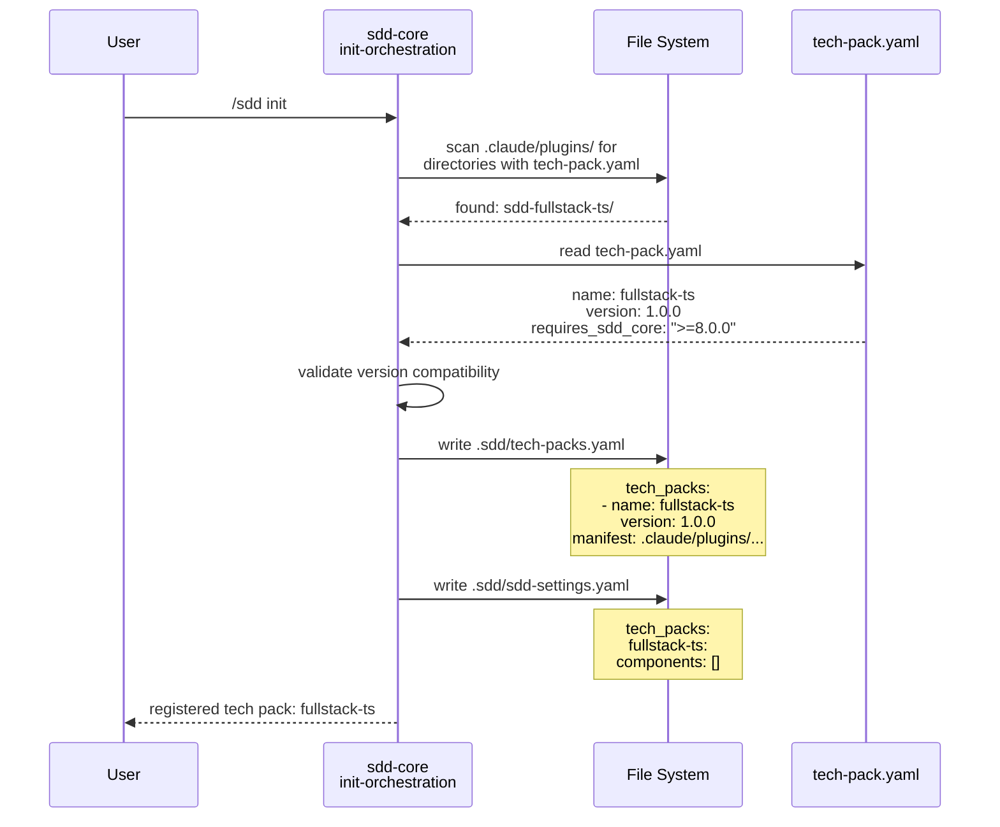
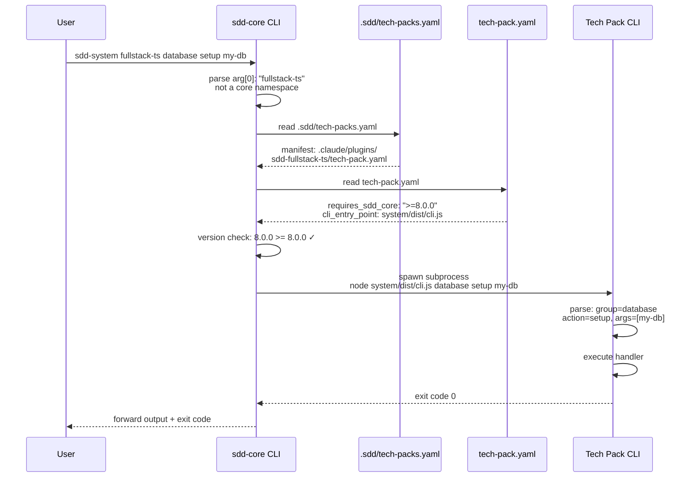
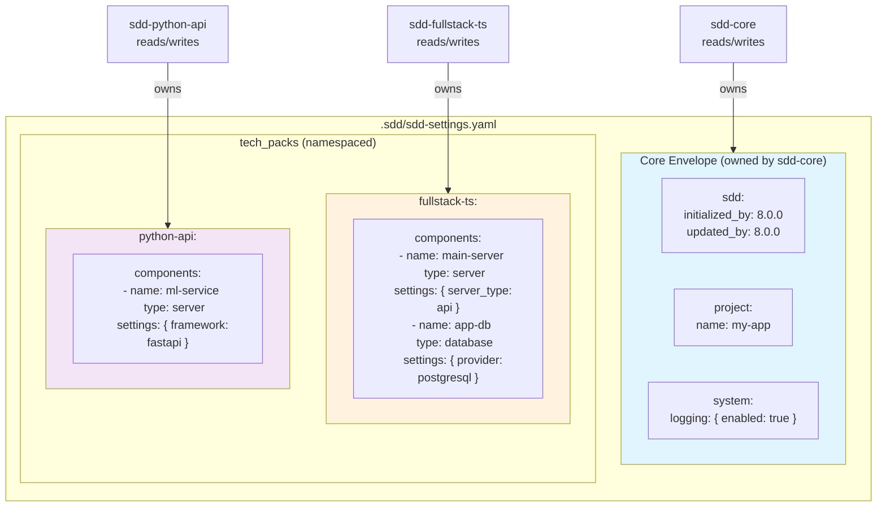
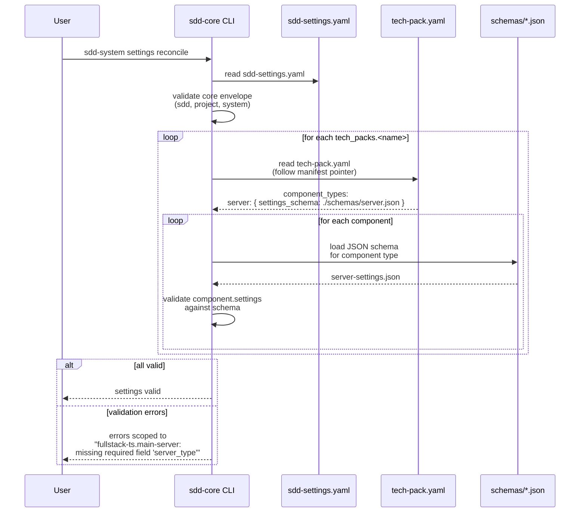
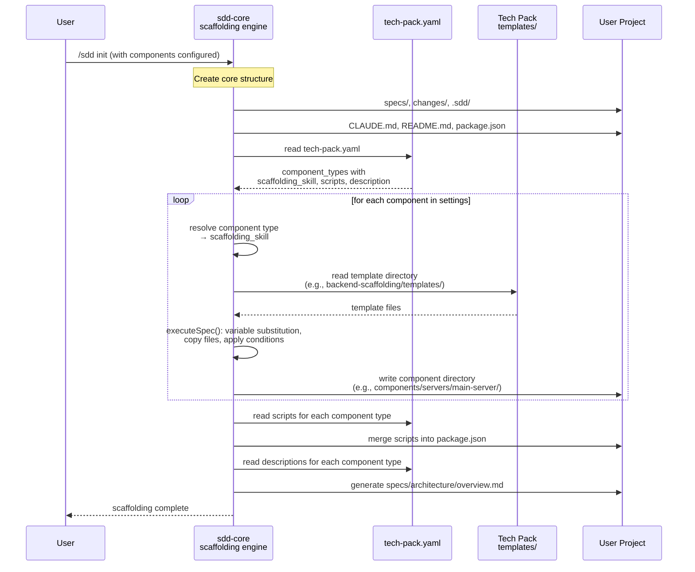
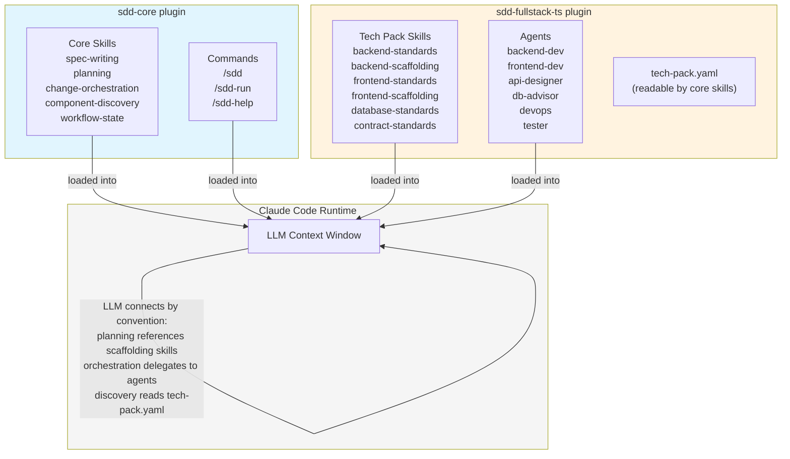
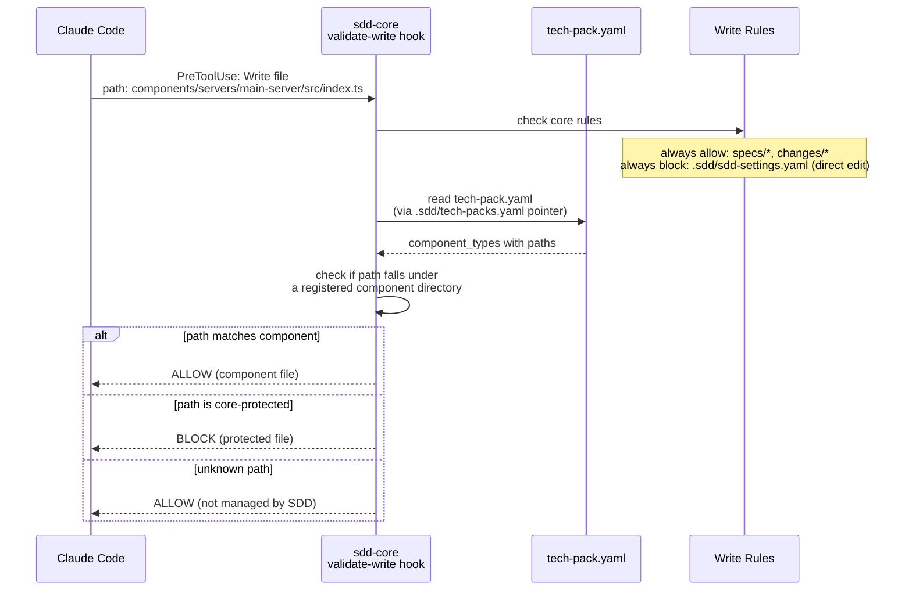
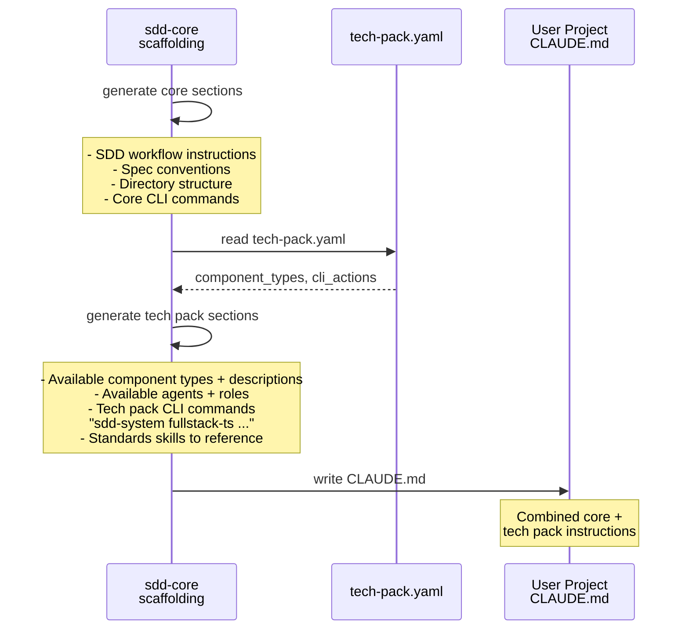
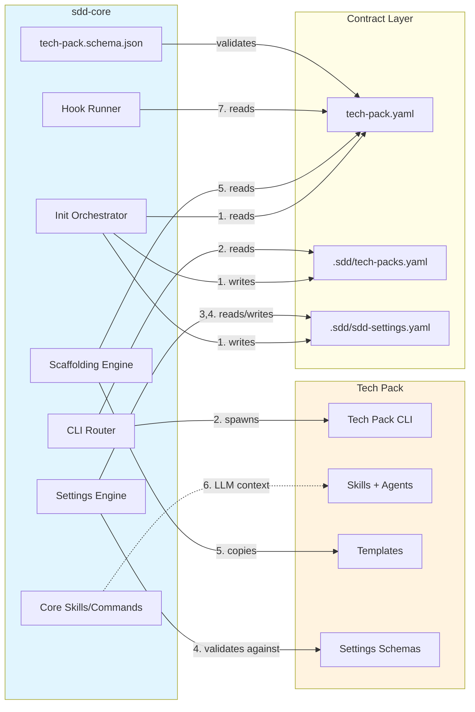

# SDD-Core / Tech Pack Integration Points

## 1. Registration (one-time, during init)

## 2. CLI Delegation (every tech pack CLI call)

## 3. Settings Namespace (ongoing read/write)

## 4. Settings Validation (during reconcile)

## 5. Project Scaffolding (during init)

## 6. Skill/Agent Discovery (LLM context, at prompt time)

## 7. Hook Integration (file write validation)

## 8. CLAUDE.md Generation (during init)

## Integration Summary

All 8 integration points flow through **`tech-pack.yaml`** as the single contract file between sdd-core and any tech pack. Integration point 6 (skill/agent discovery) is the exception — it's implicit through Claude Code loading both plugins into the same LLM context.
