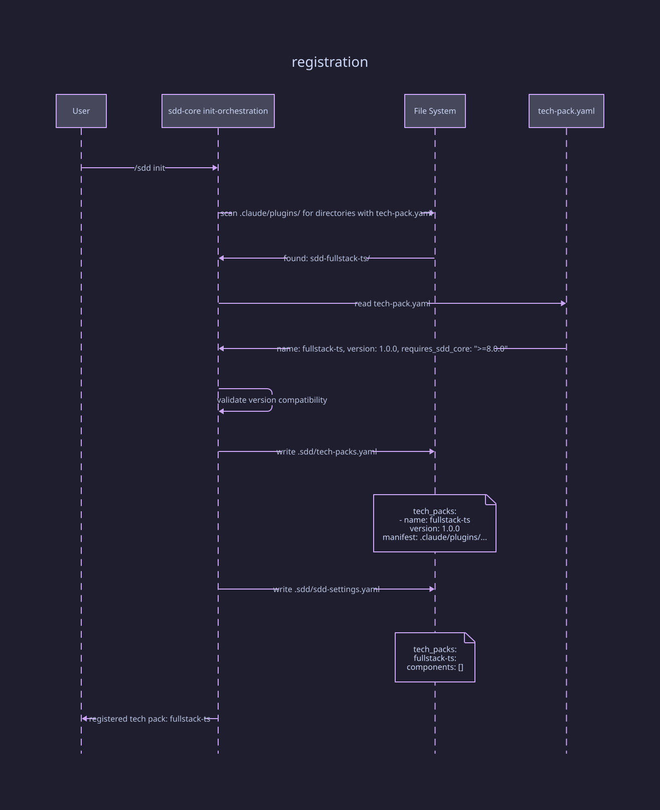
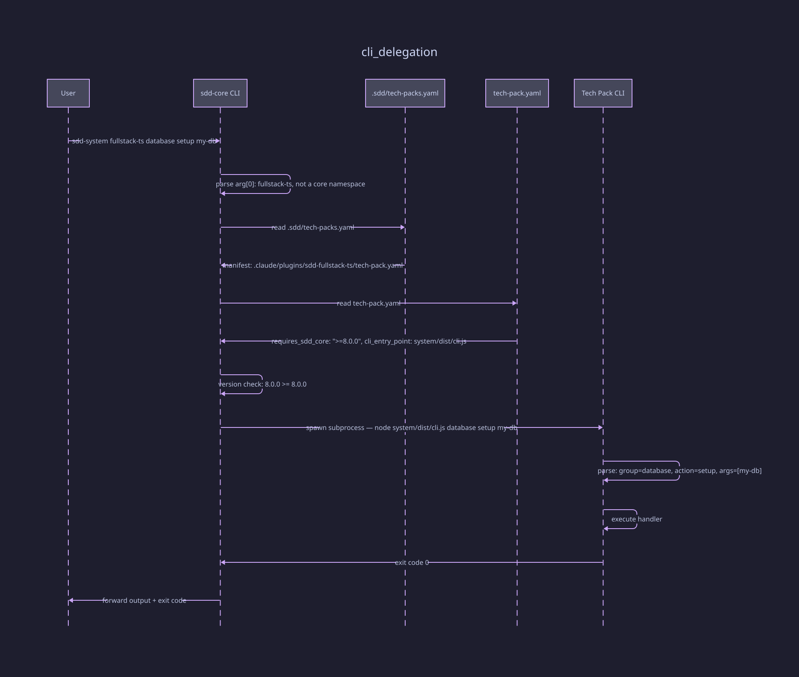
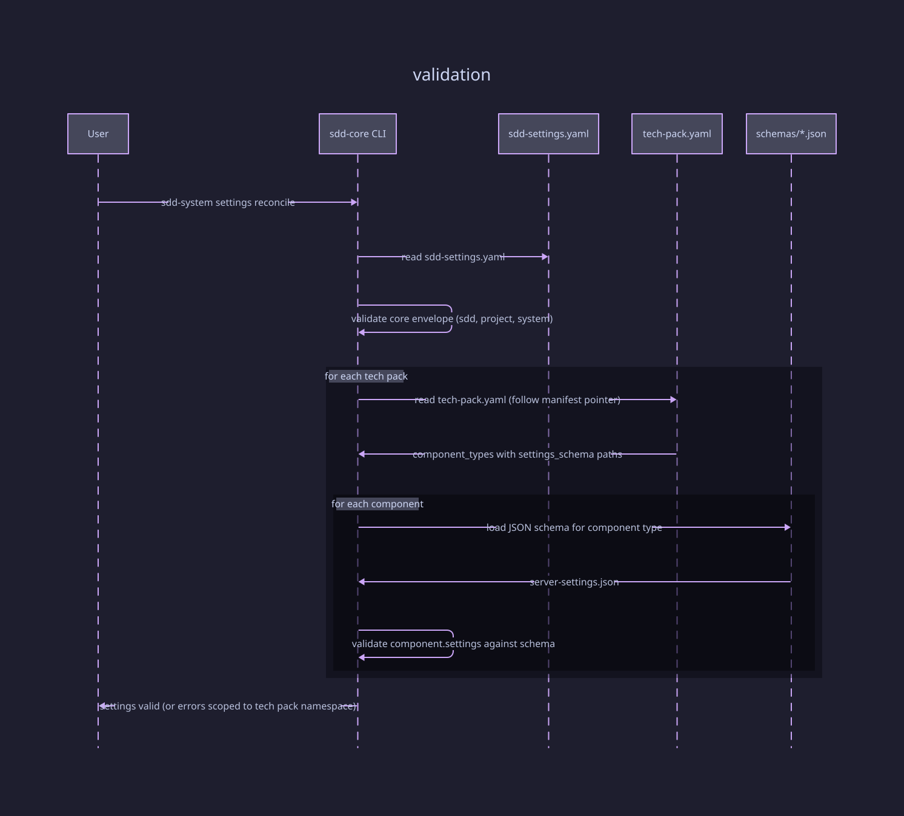
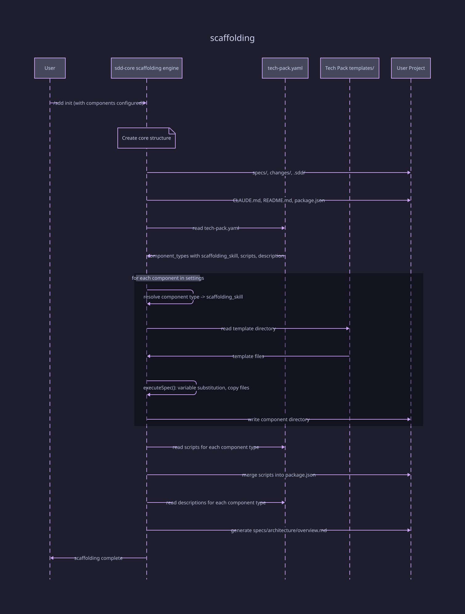
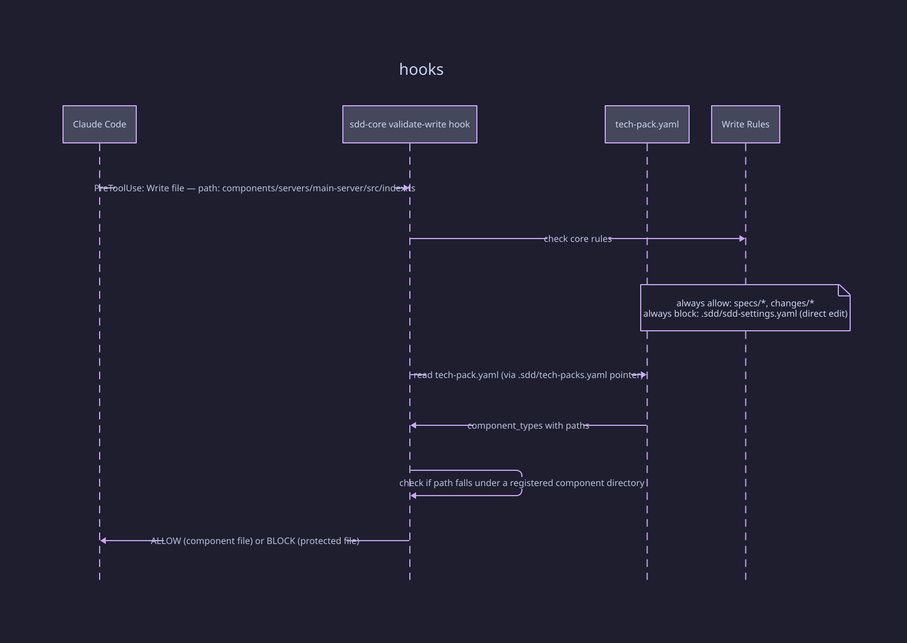
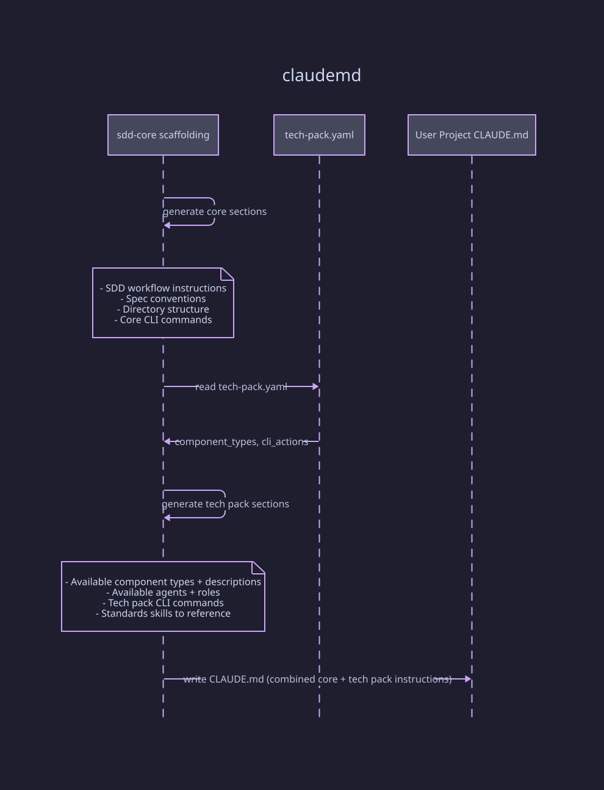
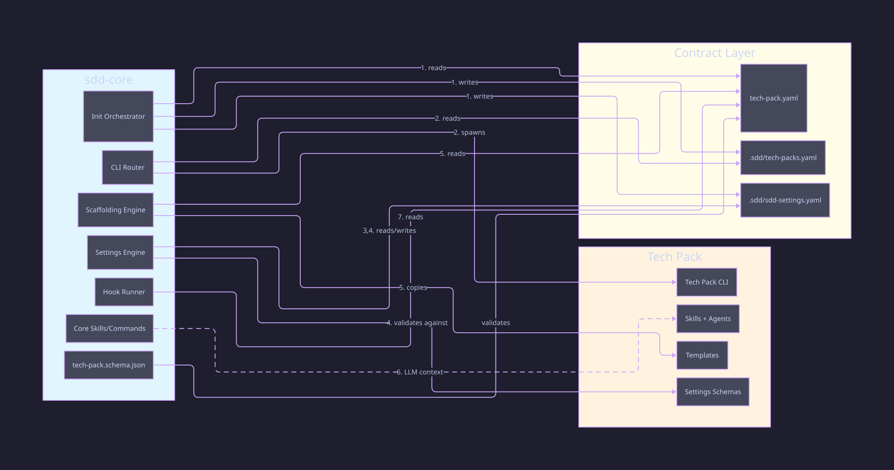

# SDD-Core / Tech Pack Integration Points

## 1. Registration (one-time, during init)

D2 source

[diagrams/01-registration.d2](diagrams/01-registration.d2)

## 2. CLI Delegation (every tech pack CLI call)

D2 source

[diagrams/02-cli-delegation.d2](diagrams/02-cli-delegation.d2)

## 3. Settings Namespace (ongoing read/write)

D2 source

[diagrams/03-settings-namespace.d2](diagrams/03-settings-namespace.d2)

## 4. Settings Validation (during reconcile)

D2 source

[diagrams/04-settings-validation.d2](diagrams/04-settings-validation.d2)

## 5. Project Scaffolding (during init)

D2 source

[diagrams/05-scaffolding.d2](diagrams/05-scaffolding.d2)

## 6. Skill/Agent Discovery (LLM context, at prompt time)

D2 source

[diagrams/06-skill-discovery.d2](diagrams/06-skill-discovery.d2)

## 7. Hook Integration (file write validation)

D2 source

[diagrams/07-hooks.d2](diagrams/07-hooks.d2)

## 8. CLAUDE.md Generation (during init)

D2 source

[diagrams/08-claudemd-gen.d2](diagrams/08-claudemd-gen.d2)

## Integration Summary

D2 source

[diagrams/09-integration-summary.d2](diagrams/09-integration-summary.d2)

All 8 integration points flow through **`tech-pack.yaml`** as the single contract file between sdd-core and any tech pack. Integration point 6 (skill/agent discovery) is the exception — it's implicit through Claude Code loading both plugins into the same LLM context.
